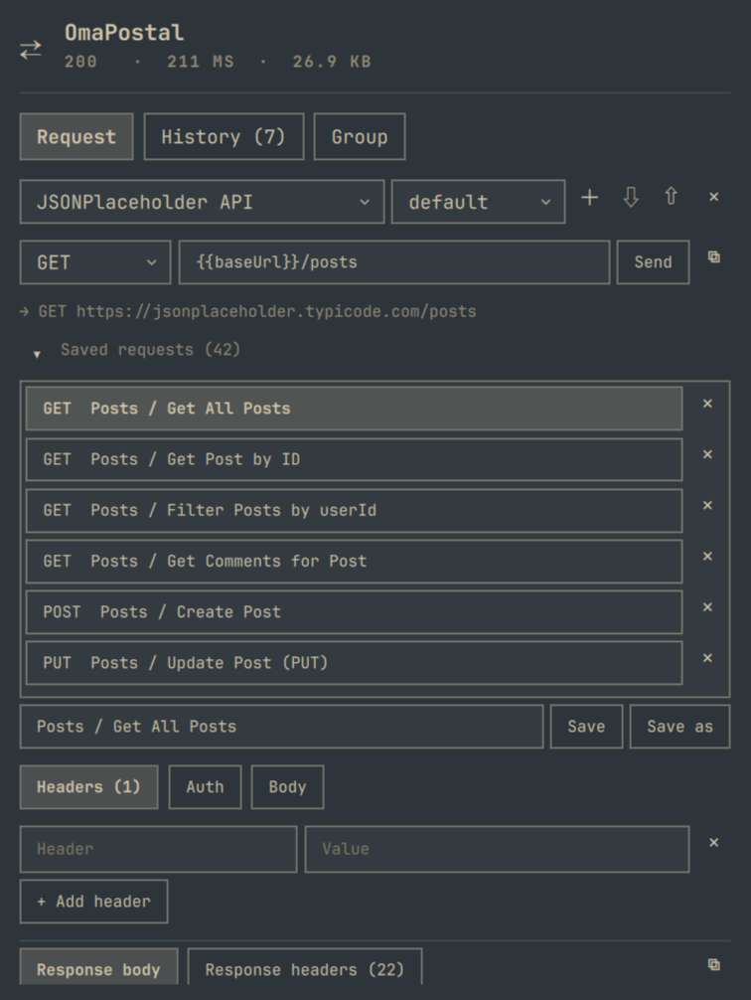
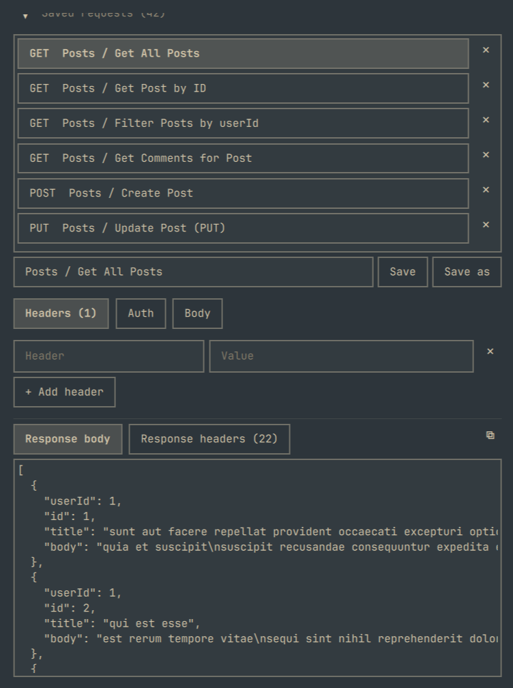
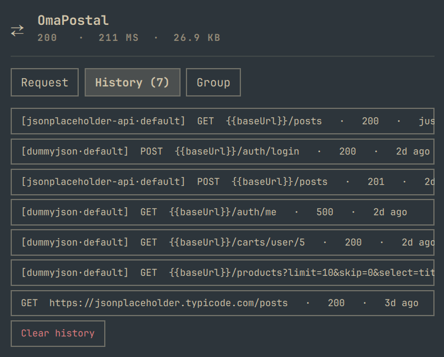
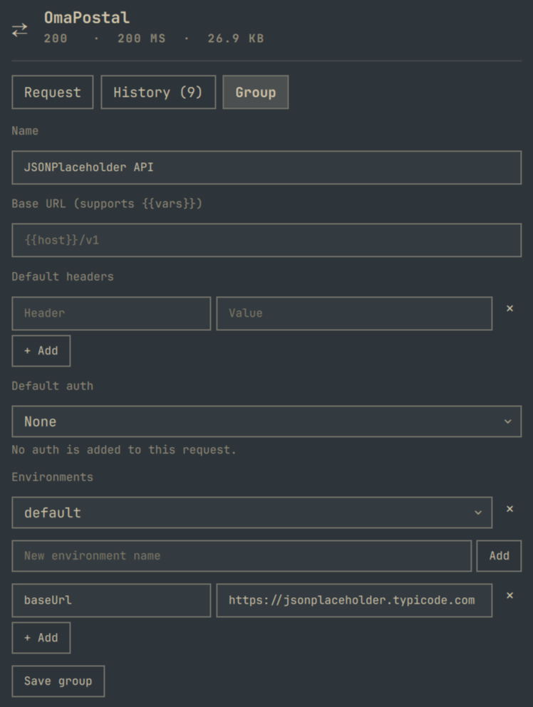

# OmaPostal

A small HTTP client for the bar: method, URL, headers, body, and a response
viewer, with a history of recent requests to replay.

<table>
<tr>
<td width="50%">



</td>
<td width="50%">



</td>
</tr>
<tr>
<td width="50%">



</td>
<td width="50%">



</td>
</tr>
</table>

## Requirements

- Omarchy (Hyprland-based) with the Quickshell shell.
- `bash`, `curl`, and `jq` (all standard on Omarchy) — the request-sending
  and group-management scripts shell out to `curl` for HTTP and `jq` for
  JSON handling.

## Install

```bash
omarchy plugin add https://github.com/murjax/OmaPostal.git --enable
```

This clones the plugin and enables it in the bar's right section (the
default from `manifest.json`). To place it elsewhere:

```bash
omarchy bar move murjax.omapostal --after omarchy.menu
```

## Remove

```bash
omarchy plugin disable murjax.omapostal   # hide the widget, keep it installed
omarchy plugin remove murjax.omapostal    # uninstall it entirely
```

## Using it

- Pick a **method**, type a **URL**, hit Enter or click **Send**.
- While a request is in flight the button reads **Cancel**; clicking it stops
  the request (and its curl process) and shows "Cancelled" — nothing is added
  to History. If a request somehow never starts or reports back, a watchdog
  resets the panel after `timeoutSec` + 15 seconds instead of leaving it stuck
  on "Sending…".
- **⧉** next to Send copies the request as a runnable `curl` command line —
  group mode's baseUrl, `{{vars}}` and auth are resolved and included
  unmasked (it's meant to paste into a terminal), same as what gets sent.
- **Headers** tab — key/value rows; `+ Add header` for more, `×` to remove.
- **Body** tab — raw text, sent as-is (no templating or auto-formatting).
- The **response** panel below shows status, time, size, and (once a
  response arrives) tabs for the response body — pretty-printed if it
  parses as JSON — and response headers. `⧉` copies whichever of the two
  is currently shown (its tooltip names the one it'll copy).
- **History** tab lists the last requests (newest first); clicking one
  loads it back into the Request tab for editing or replay. Identical
  requests (same method, URL, headers, body, group and env) are
  de-duplicated: a resend moves the entry to the top, while clicking an
  entry only loads it. Per-request auth overrides are not stored in history
  and reset to inherit on replay. If a group-mode entry's group is later
  deleted or renamed, it falls back to the fully-substituted request as it
  was actually sent (real URL, headers and body — no more `{{vars}}` or
  group-relative path), rather than the raw unresolvable path; any masked
  auth header is dropped instead of being resent as a literal `••••`.
- **Group** and **Env** pickers sit above the URL row (the group picker
  includes "None (ad-hoc)"; the Env picker shows when the group has
  environments). **＋** ("New group") creates a group from a name; **⇩**
  ("Import a Postman collection") reveals the import field — either button
  flips to **✕** ("Cancel...") while its form is open, so clicking it again
  closes the form. With a group selected, **×** next to the picker deletes
  it after a confirmation prompt (no undo — falls back to "None (ad-hoc)").
  With no group selected, a hint explains that saving requests requires
  picking or creating one.
- With a group selected, its **saved requests** are listed in a fixed-height
  box that scrolls internally once there are more than a handful, so a big
  group doesn't push the rest of the panel out of view. Click the **Saved
  requests** label, or its ▸/▾ arrow, to collapse or expand the section —
  expanding it focuses the filter field below. That field narrows the list
  by name, method, or path (the count switches from "Saved requests (N)" to
  "Saved requests (N of M)" while filtering, with a **×** to clear it, and a
  "No saved requests match" message if nothing does); hovering an entry
  shows its full path. Click one to load it (it's highlighted while
  loaded). **Save** overwrites the loaded request with the current fields —
  editing the name field first renames it, dropping the old entry instead
  of leaving a duplicate. **Save as** always saves a copy under the typed
  name (an existing name with that exact text is overwritten), leaving the
  loaded request's original entry alone. **×** deletes one, after a
  confirmation prompt (no undo). In group mode the URL field holds a path
  appended to the group's base URL.
- **Auth** tab (group mode only; tabs are Headers / Auth / Body) — Inherit /
  None / Bearer / Basic / API key. Ad-hoc requests have no Auth tab; keep
  using an `Authorization` header.
- The Headers tab shows the group's default headers first, dimmed; one
  overridden by a request header is struck through.
- **Group** tab (beside Request and History, when a group is selected) —
  edit the name, base URL, default headers, default auth and environments,
  then **Save group**.

## How it sends requests

`Panel.qml` writes the request (method, URL, headers, body, timeout) as
JSON to a runtime-dir temp file, then runs `bin/http-send` on it, which
shells out to `curl` and prints one JSON result line: status, status text,
time in ms, size, response headers, and the response body (capped at 2MB,
flagged `truncated` past that). Redirects are followed (`-L`, up to 10
hops). A 4xx/5xx response is still `ok:true` — the HTTP exchange completed;
`ok:false` means it didn't (bad input, DNS/connect/TLS/timeout failure),
and `error` carries curl's own message.

"Copy as curl" goes through `bin/http-curl` instead: same request-file shape
and the same group-mode resolution (`lib/resolve.jq`) as `http-send`, but it
only prints `{"ok","curl","error"}` — the formatted command line — and never
runs curl itself.

## Configuration

Optional keys on the widget's `shell.json` layout entry
(`~/.config/omarchy/shell.json`):

```json
{
  "id": "murjax.omapostal",
  "timeoutSec": 30,
  "historyLimit": 20
}
```

- `timeoutSec` — per-request timeout (5–300s).
- `historyLimit` — how many recent requests to keep (1–100).

## Groups

A group is one JSON file at `~/.config/omarchy/http/groups/<slug>.json`
(hand-editable):

```json
{
  "name": "Acme API",
  "baseUrl": "{{host}}/v1",
  "headers": { "Accept": "application/json" },
  "auth": { "type": "bearer", "token": "{{token}}" },
  "environments": {
    "dev":  { "host": "http://localhost:4000", "token": "dev-secret" },
    "prod": { "host": "https://api.acme.com",  "token": "prod-secret" }
  },
  "activeEnv": "dev",
  "requests": [
    { "name": "List users", "method": "GET", "path": "/users",
      "headers": {}, "body": "", "auth": "inherit" }
  ]
}
```

Auth types: `none`, `bearer` (`token`), `basic` (`username`, `password`),
`apiKey` (`name`, `value`, `in`: `header` or `query`). A request's `auth`
is `"inherit"` (default), `"none"`, or a full auth block that overrides the
group's.

Resolution rules:

1. **URL** — the request `path` is appended to `baseUrl`; an absolute
   `http://` / `https://` URL skips `baseUrl`.
2. **Headers** — group headers first, then request headers; the request
   wins, compared case-insensitively.
3. **Auth** is applied last: it overwrites an explicit same-named header
   (e.g. `Authorization`) unless the request's auth is `none`. Bearer sets
   `Authorization: Bearer ...`, basic sets `Authorization: Basic <base64>`,
   apiKey sets a header or a URL-encoded query parameter.
4. **`{{var}}`** in `baseUrl`, path, headers, body and auth fields is
   replaced from the selected environment (`env`, else `activeEnv`). An
   undefined variable is an error naming it (`ok:false`); it is never sent
   literally. Unknown environment, unknown request and a missing/invalid
   group file are errors too. In group mode any `{{name}}` in the URL,
   headers, body or auth is treated as a variable (there is no escape for a
   literal `{{`).

### Importing / exporting Postman collections

- **⇩** ("Import a Postman collection") next to the group picker reveals a
  field for a `.postman_collection.json` file path (a leading `~` is
  expanded to your home directory); **Import** converts it into a new group
  and selects it. Postman folders don't map to anything in
  this plugin, so they flatten into request names (`Folder / Sub / Request`);
  collection variables become one `default` environment. Auth converts for
  `bearer`, `basic` and `apikey`/`noauth`; anything else (OAuth2, digest,
  AWS Sig v4, …) imports as no auth. Bodies convert for `raw` and
  `urlencoded`; `formdata`/`file`/`graphql` bodies are dropped (no multipart
  support). Anything skipped is reported as a warning after import.
- **⇧** ("Export group as a Postman collection") next to the group picker
  (with a group selected) copies a Postman v2.1 collection JSON — built from
  the group's requests and its *active* environment's variables — to the
  clipboard. Only that one environment round-trips; Postman collections
  don't carry multiple named environments.
- Both directions are also scriptable: see `bin/http-groups import`/`export`
  below.

For scripting, `bin/http-send` accepts these extra request-file fields:
`groupFile` (path to the group file), `env`, `requestName` (a saved
request to start from), `path` (relative path, joined to `baseUrl`), and
`auth`, along with the usual `method`, `headers`, `body`. Without
`groupFile`, behavior is unchanged. The result gains
`resolved` (`method`, `url`, `headers`, `body`) showing what was sent, with
auth values masked as `••••`.

## Security note

Headers and body are stored **in plaintext**: transiently in the runtime
temp file used to launch each request, and persistently in the history
file at `~/.local/state/omarchy/murjax-http-history.json` (bounded by
`historyLimit`). If you paste a bearer token or API key into a header
while testing, it will sit in that history file until cleared. Use the
**Clear history** button in the History tab to wipe it (after a
confirmation prompt — no undo). History never
stores auth values (bearer tokens, passwords, API keys), but it does store
request headers you typed yourself.

Group files store tokens, passwords and API keys in **plaintext** (bar
`historyLimit` does not apply to them). Keep that in mind before
committing or sharing a group file.

## Scripts

```
bin/http-send <request-file>            # send one request, print one JSON result line
bin/http-groups list                    # one JSON line: [{"slug","path","name"}, ...]
bin/http-groups new <name>              # create an empty group file, print {"slug","path","name"}
bin/http-groups import <file> [name]    # convert a Postman v2.x collection into a new group;
                                         # print {"slug","path","name","requestCount","warnings":[...]}
bin/http-groups export <slug>           # print the group as a Postman v2.1 collection (stdout)
bin/http-groups delete <slug>           # delete the group file, print {"slug","path","deleted":true}
```

`<request-file>`: `{"method":"GET","url":"...","headers":{...},"body":"...","timeoutSec":30}`

Usable outside the bar for scripting/debugging.

## Tests

```
tests/run.sh
```

Covers input validation (missing file/URL, bad scheme), a connection-refused
failure, and a happy path against a local Python test server (status,
headers, redirect-following, and that the request body/headers actually
reach the server); group resolution (base URL, header merge, `{{var}}`
substitution and errors, masking); every auth type; `bin/http-groups`,
including Postman import/export against a real fixture collection
(`tests/fixtures/JSONPlaceholder.postman_collection.json`); and unit tests
for the JS libraries (history de-duplication, group helpers), which need
`node` and are skipped if it is absent.

## Limitations

- No scripts (pre-request/test), cURL import, or nested folders (Postman
  folders flatten into request names on import). Auth import/export only
  covers bearer/basic/apiKey/none — OAuth2, digest, AWS Sig v4 and similar
  drop to no auth with a warning. Replaying a history entry does not restore
  a per-request auth override (it resets to inherit). If its group is later
  deleted, an apiKey-in-query auth masked as `key=••••` in the resolved URL
  is not stripped like a masked header is — edit it out by hand before
  sending.
- Headers are unique key → value pairs; duplicate request headers of the
  same name aren't supported. Duplicate response headers of the same name
  (e.g. multiple `Set-Cookie`) are combined into one comma-separated value.
- Response body over 2MB is truncated for display (full status/timing/size
  metadata is still accurate).

## License

MIT
